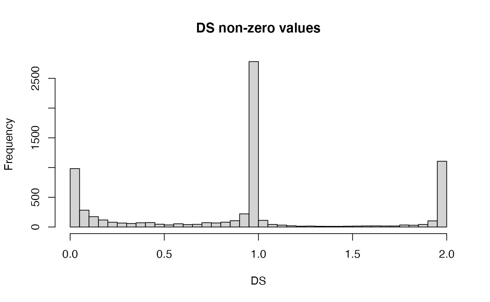
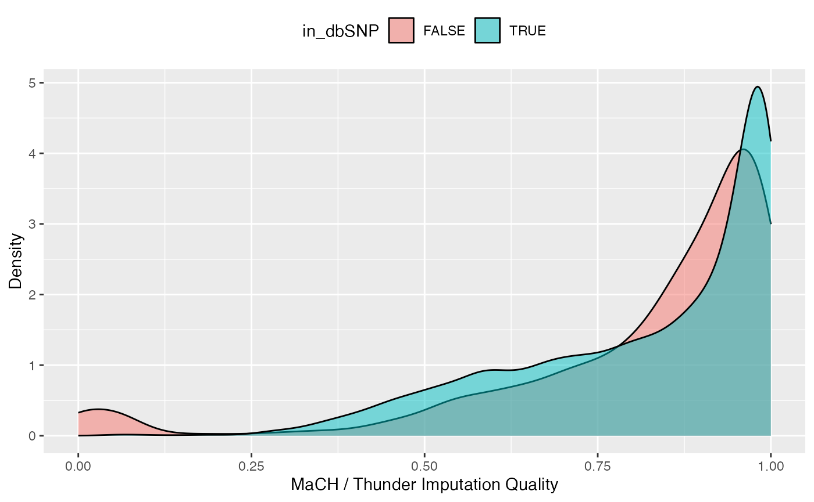

<div id="main" class="col-md-9" role="main">

# Overview of the VariantAnnotation Package

<div class="section level2">

## Introduction

This vignette outlines a work flow for annotating and filtering genetic
variants using the
*[VariantAnnotation](https://bioconductor.org/packages/3.24/VariantAnnotation)*
package. Sample data are in VariantCall Format (VCF) and are a subset of
chromosome 22 from [1000
Genomes](http://ftp.1000genomes.ebi.ac.uk/vol1/ftp/release/20110521/).
VCF text files contain meta-information lines, a header line with column
names, data lines with information about a position in the genome, and
optional genotype information on samples for each position. Samtools
organisation and repositories describes the [VCF
format](http://samtools.github.io/hts-specs/VCFv4.4.pdf) in detail.

Data are read in from a VCF file and variants identified according to
region such as `coding`, `intron`, `intergenic`, `spliceSite` etc. Amino
acid coding changes are computed for the non-synonymous variants and
SIFT and PolyPhen databases provide predictions of how severly the
coding changes affect protein function.

</div>

<div class="section level2">

## Variant Call Format (VCF) files

<div class="section level3">

### Data import and exploration

Data are parsed into a `VCF` object with `readVcf`.

<div id="cb1" class="sourceCode">

``` r
library(VariantAnnotation)
fl <- system.file("extdata", "chr22.vcf.gz", package="VariantAnnotation")
vcf <- readVcf(fl, "hg19")
vcf
```

</div>

    ## class: CollapsedVCF 
    ## dim: 10376 5 
    ## rowRanges(vcf):
    ##   GRanges with 5 metadata columns: paramRangeID, REF, ALT, QUAL, FILTER
    ## info(vcf):
    ##   DataFrame with 22 columns: LDAF, AVGPOST, RSQ, ERATE, THETA, CIEND, CIPOS,...
    ## info(header(vcf)):
    ##              Number Type    Description                                        
    ##    LDAF      1      Float   MLE Allele Frequency Accounting for LD             
    ##    AVGPOST   1      Float   Average posterior probability from MaCH/Thunder    
    ##    RSQ       1      Float   Genotype imputation quality from MaCH/Thunder      
    ##    ERATE     1      Float   Per-marker Mutation rate from MaCH/Thunder         
    ##    THETA     1      Float   Per-marker Transition rate from MaCH/Thunder       
    ##    CIEND     2      Integer Confidence interval around END for imprecise var...
    ##    CIPOS     2      Integer Confidence interval around POS for imprecise var...
    ##    END       1      Integer End position of the variant described in this re...
    ##    HOMLEN    .      Integer Length of base pair identical micro-homology at ...
    ##    HOMSEQ    .      String  Sequence of base pair identical micro-homology a...
    ##    SVLEN     1      Integer Difference in length between REF and ALT alleles   
    ##    SVTYPE    1      String  Type of structural variant                         
    ##    AC        .      Integer Alternate Allele Count                             
    ##    AN        1      Integer Total Allele Count                                 
    ##    AA        1      String  Ancestral Allele, ftp://ftp.1000genomes.ebi.ac.u...
    ##    AF        1      Float   Global Allele Frequency based on AC/AN             
    ##    AMR_AF    1      Float   Allele Frequency for samples from AMR based on A...
    ##    ASN_AF    1      Float   Allele Frequency for samples from ASN based on A...
    ##    AFR_AF    1      Float   Allele Frequency for samples from AFR based on A...
    ##    EUR_AF    1      Float   Allele Frequency for samples from EUR based on A...
    ##    VT        1      String  indicates what type of variant the line represents 
    ##    SNPSOURCE .      String  indicates if a snp was called when analysing the...
    ## geno(vcf):
    ##   List of length 3: GT, DS, GL
    ## geno(header(vcf)):
    ##       Number Type   Description                      
    ##    GT 1      String Genotype                         
    ##    DS 1      Float  Genotype dosage from MaCH/Thunder
    ##    GL G      Float  Genotype Likelihoods

<div class="section level4">

#### Header information

Header information can be extracted from the VCF with `header()`. We see
there are 5 samples, 1 piece of meta information, 22 info fields and 3
geno fields.

<div id="cb3" class="sourceCode">

``` r
header(vcf)
```

</div>

    ## class: VCFHeader 
    ## samples(5): HG00096 HG00097 HG00099 HG00100 HG00101
    ## meta(1): fileformat
    ## fixed(2): FILTER ALT
    ## info(22): LDAF AVGPOST ... VT SNPSOURCE
    ## geno(3): GT DS GL

Data can be further extracted using the named accessors.

<div id="cb5" class="sourceCode">

``` r
samples(header(vcf))
```

</div>

    ## [1] "HG00096" "HG00097" "HG00099" "HG00100" "HG00101"

<div id="cb7" class="sourceCode">

``` r
geno(header(vcf))
```

</div>

    ## DataFrame with 3 rows and 3 columns
    ##         Number        Type            Description
    ##    <character> <character>            <character>
    ## GT           1      String               Genotype
    ## DS           1       Float Genotype dosage from..
    ## GL           G       Float   Genotype Likelihoods

</div>

<div class="section level4">

#### Genomic positions

`rowRanges` contains information from the CHROM, POS, and ID fields of
the VCF file, represented as a `GRanges`. The `paramRangeID` column is
meaningful when reading subsets of data and is discussed further below.

<div id="cb9" class="sourceCode">

``` r
head(rowRanges(vcf), 3)
```

</div>

    ## GRanges object with 3 ranges and 5 metadata columns:
    ##               seqnames    ranges strand | paramRangeID            REF
    ##                  <Rle> <IRanges>  <Rle> |     <factor> <DNAStringSet>
    ##     rs7410291       22  50300078      * |           NA              A
    ##   rs147922003       22  50300086      * |           NA              C
    ##   rs114143073       22  50300101      * |           NA              G
    ##                              ALT      QUAL      FILTER
    ##               <DNAStringSetList> <numeric> <character>
    ##     rs7410291                  G       100        PASS
    ##   rs147922003                  T       100        PASS
    ##   rs114143073                  A       100        PASS
    ##   -------
    ##   seqinfo: 1 sequence from hg19 genome; no seqlengths

Individual fields can be pulled out with named accessors. Here we see
`REF` is stored as a `DNAStringSet` and `qual` is a numeric vector.

<div id="cb11" class="sourceCode">

``` r
ref(vcf)[1:5]
```

</div>

    ## DNAStringSet object of length 5:
    ##     width seq
    ## [1]     1 A
    ## [2]     1 C
    ## [3]     1 G
    ## [4]     1 C
    ## [5]     1 C

<div id="cb13" class="sourceCode">

``` r
qual(vcf)[1:5]
```

</div>

    ## [1] 100 100 100 100 100

`ALT` is a `DNAStringSetList` (allows for multiple alternate alleles per
variant) or a `DNAStringSet`. When structural variants are present it
will be a `CharacterList`.

<div id="cb15" class="sourceCode">

``` r
alt(vcf)[1:5]
```

</div>

    ## DNAStringSetList of length 5
    ## [[1]] G
    ## [[2]] T
    ## [[3]] A
    ## [[4]] T
    ## [[5]] T

</div>

<div class="section level4">

#### Genotype data

Genotype data described in the `FORMAT` fields are parsed into the geno
slot. The data are unique to each sample and each sample may have
multiple values variable. Because of this, the data are parsed into
matrices or arrays where the rows represent the variants and the columns
the samples. Multidimentional arrays indicate multiple values per
sample. In this file all variables are matrices.

<div id="cb17" class="sourceCode">

``` r
geno(vcf)
```

</div>

    ## List of length 3
    ## names(3): GT DS GL

<div id="cb19" class="sourceCode">

``` r
sapply(geno(vcf), class)
```

</div>

    ##      GT       DS       GL      
    ## [1,] "matrix" "matrix" "matrix"
    ## [2,] "array"  "array"  "array"

Let’s take a closer look at the genotype dosage (DS) variable. The
header provides the variable definition and type.

<div id="cb21" class="sourceCode">

``` r
geno(header(vcf))["DS",]
```

</div>

    ## DataFrame with 1 row and 3 columns
    ##         Number        Type            Description
    ##    <character> <character>            <character>
    ## DS           1       Float Genotype dosage from..

These data are stored as a 10376 x 5 matrix. Each of the five samples
(columns) has a single value per variant location (row).

<div id="cb23" class="sourceCode">

``` r
DS <-geno(vcf)$DS
dim(DS)
```

</div>

    ## [1] 10376     5

<div id="cb25" class="sourceCode">

``` r
DS[1:3,]
```

</div>

    ##             HG00096 HG00097 HG00099 HG00100 HG00101
    ## rs7410291         0       0       1       0       0
    ## rs147922003       0       0       0       0       0
    ## rs114143073       0       0       0       0       0

DS is also known as ‘posterior mean genotypes’ and range in value from
\[0, 2\]. To get a sense of variable distribution, we compute a five
number summary of the minimum, lower-hinge (first quartile), median,
upper-hinge (third quartile) and maximum.

<div id="cb27" class="sourceCode">

``` r
fivenum(DS)
```

</div>

    ## [1] 0 0 0 0 2

The majority of these values (86%) are zero.

<div id="cb29" class="sourceCode">

``` r
length(which(DS==0))/length(DS)
```

</div>

    ## [1] 0.8621627

View the distribution of the non-zero values.

<div id="cb31" class="sourceCode">

``` r
hist(DS[DS != 0], breaks=seq(0, 2, by=0.05),
    main="DS non-zero values", xlab="DS")
```

</div>



</div>

<div class="section level4">

#### Info data

In contrast to the genotype data, the info data are unique to the
variant and the same across samples. All info variables are represented
in a single `DataFrame`.

<div id="cb32" class="sourceCode">

``` r
info(vcf)[1:4, 1:5]
```

</div>

    ## DataFrame with 4 rows and 5 columns
    ##                  LDAF   AVGPOST       RSQ     ERATE     THETA
    ##             <numeric> <numeric> <numeric> <numeric> <numeric>
    ## rs7410291      0.3431    0.9890    0.9856     2e-03    0.0005
    ## rs147922003    0.0091    0.9963    0.8398     5e-04    0.0011
    ## rs114143073    0.0098    0.9891    0.5919     7e-04    0.0008
    ## rs141778433    0.0062    0.9950    0.6756     9e-04    0.0003

We will use the info data to compare quality measures between novel
(i.e., not in dbSNP) and known (i.e., in dbSNP) variants and the variant
type present in the file. Variants with membership in dbSNP can be
identified by using the appropriate SNPlocs package for the hg19 genome
(GRCh37).

<div id="cb34" class="sourceCode">

``` r
library(SNPlocs.Hsapiens.dbSNP144.GRCh37)
vcf_rsids <- names(rowRanges(vcf))
chr22snps <- snpsBySeqname(SNPlocs.Hsapiens.dbSNP144.GRCh37, "22")
chr22_rsids <- mcols(chr22snps)$RefSNP_id
in_dbSNP <- vcf_rsids %in% chr22_rsids
table(in_dbSNP) 
```

</div>

    ## in_dbSNP
    ## FALSE  TRUE 
    ##  1114  9262

Info variables of interest are ‘VT’, ‘LDAF’ and ‘RSQ’. The header offers
more details on these variables.

<div id="cb36" class="sourceCode">

``` r
info(header(vcf))[c("VT", "LDAF", "RSQ"),]
```

</div>

    ## DataFrame with 3 rows and 3 columns
    ##           Number        Type            Description
    ##      <character> <character>            <character>
    ## VT             1      String indicates what type ..
    ## LDAF           1       Float MLE Allele Frequency..
    ## RSQ            1       Float Genotype imputation ..

Create a data frame of quality measures of interest …

<div id="cb38" class="sourceCode">

``` r
metrics <- data.frame(QUAL=qual(vcf), in_dbSNP=in_dbSNP,
    VT=info(vcf)$VT, LDAF=info(vcf)$LDAF, RSQ=info(vcf)$RSQ)
```

</div>

and visualize the distribution of qualities using
*[ggplot2](https://CRAN.R-project.org/package=ggplot2)*. For instance,
genotype imputation quality is higher for the known variants in dbSNP.

<div id="cb39" class="sourceCode">

``` r
library(ggplot2)
ggplot(metrics, aes(x=RSQ, fill=in_dbSNP)) +
    geom_density(alpha=0.5) +
    scale_x_continuous(name="MaCH / Thunder Imputation Quality") +
    scale_y_continuous(name="Density") +
    theme(legend.position="top")
```

</div>



</div>

</div>

<div class="section level3">

### Import data subsets

When working with large VCF files it may be more efficient to read in
subsets of the data. This can be accomplished by selecting genomic
coordinates (ranges) or by specific fields from the VCF file.

<div class="section level4">

#### Select genomic coordinates

To read in a portion of chromosome 22, create a `GRanges` with the
regions of interest.

<div id="cb40" class="sourceCode">

``` r
rng <- GRanges(seqnames="22", ranges=IRanges(
           start=c(50301422, 50989541), 
           end=c(50312106, 51001328),
           names=c("gene_79087", "gene_644186")))
```

</div>

When ranges are specified, the VCF file must have an accompanying Tabix
index file. See `indexTabix` for help creating an index.

<div id="cb41" class="sourceCode">

``` r
tab <- TabixFile(fl)
vcf_rng <- readVcf(tab, "hg19", param=rng)
```

</div>

The `paramRangesID` column distinguishes which records came from which
param range.

<div id="cb42" class="sourceCode">

``` r
head(rowRanges(vcf_rng), 3)
```

</div>

    ## GRanges object with 3 ranges and 5 metadata columns:
    ##                   seqnames    ranges strand | paramRangeID            REF
    ##                      <Rle> <IRanges>  <Rle> |     <factor> <DNAStringSet>
    ##       rs114335781       22  50301422      * |   gene_79087              G
    ##         rs8135963       22  50301476      * |   gene_79087              T
    ##   22:50301488_C/T       22  50301488      * |   gene_79087              C
    ##                                  ALT      QUAL      FILTER
    ##                   <DNAStringSetList> <numeric> <character>
    ##       rs114335781                  A       100        PASS
    ##         rs8135963                  C       100        PASS
    ##   22:50301488_C/T                  T       100        PASS
    ##   -------
    ##   seqinfo: 1 sequence from hg19 genome; no seqlengths

</div>

<div class="section level4">

#### Select VCF fields

Data import can also be defined by the `fixed`, `info` and `geno`
fields. Fields available for import are described in the header
information. To view the header before reading in the data, use
`ScanVcfHeader`.

<div id="cb44" class="sourceCode">

``` r
hdr <- scanVcfHeader(fl)
## e.g., INFO and GENO fields
head(info(hdr), 3)
```

</div>

    ## DataFrame with 3 rows and 3 columns
    ##              Number        Type            Description
    ##         <character> <character>            <character>
    ## LDAF              1       Float MLE Allele Frequency..
    ## AVGPOST           1       Float Average posterior pr..
    ## RSQ               1       Float Genotype imputation ..

<div id="cb46" class="sourceCode">

``` r
head(geno(hdr), 3)
```

</div>

    ## DataFrame with 3 rows and 3 columns
    ##         Number        Type            Description
    ##    <character> <character>            <character>
    ## GT           1      String               Genotype
    ## DS           1       Float Genotype dosage from..
    ## GL           G       Float   Genotype Likelihoods

To subset on “LDAF” and “GT” we specify them as `character` vectors in
the `info` and `geno` arguments to `ScanVcfParam`. This creates a
`ScanVcfParam` object which is used as the `param` argument to
`readVcf`.

<div id="cb48" class="sourceCode">

``` r
## Return all 'fixed' fields, "LAF" from 'info' and "GT" from 'geno'
svp <- ScanVcfParam(info="LDAF", geno="GT")
vcf1 <- readVcf(fl, "hg19", svp)
names(geno(vcf1))
```

</div>

    ## [1] "GT"

To subset on both genomic coordinates and fields the `ScanVcfParam`
object must contain both.

<div id="cb50" class="sourceCode">

``` r
svp_all <- ScanVcfParam(info="LDAF", geno="GT", which=rng)
svp_all
```

</div>

    ## class: ScanVcfParam 
    ## vcfWhich: 1 elements
    ## vcfFixed: character() [All] 
    ## vcfInfo: LDAF 
    ## vcfGeno: GT 
    ## vcfSamples:

</div>

</div>

</div>

<div class="section level2">

## Locating variants in and around genes

Variant location with respect to genes can be identified with the
`locateVariants` function. Regions are specified in the `region`
argument and can be one of the following constructors: CodingVariants,
IntronVariants, FiveUTRVariants, ThreeUTRVariants, IntergenicVariants,
SpliceSiteVariants or PromoterVariants. Location definitions are shown
in Table @ref(tab:table).

| Location   | Details                                                    |
|------------|------------------------------------------------------------|
| coding     | falls *within* a coding region                             |
| fiveUTR    | falls *within* a 5’ untranslated region                    |
| threeUTR   | falls *within* a 3’ untranslated region                    |
| intron     | falls *within* an intron region                            |
| intergenic | does not fall *within* a transcript associated with a gene |
| spliceSite | overlaps any portion of the first 2 or last 2              |
| promoter   | falls *within* a promoter region of a transcript           |

(\#tab:table) Variant locations

For overlap methods to work properly the chromosome names (seqlevels)
must be compatible in the objects being compared. The VCF data
chromosome names are represented by number, i.e., ‘22’, but the TxDb
chromosome names are preceded with ‘chr’. Seqlevels in the VCF can be
modified with the `seqlevels` function.

<div id="cb52" class="sourceCode">

``` r
library(TxDb.Hsapiens.UCSC.hg19.knownGene)
txdb <- TxDb.Hsapiens.UCSC.hg19.knownGene
seqlevels(vcf) <- "chr22"
rd <- rowRanges(vcf)
loc <- locateVariants(rd, txdb, CodingVariants())
head(loc, 3)
```

</div>

    ## GRanges object with 3 ranges and 9 metadata columns:
    ##               seqnames    ranges strand | LOCATION  LOCSTART    LOCEND
    ##                  <Rle> <IRanges>  <Rle> | <factor> <integer> <integer>
    ##   rs114335781    chr22  50301422      - |   coding       939       939
    ##   rs114335781    chr22  50301422      - |   coding       145       145
    ##   rs114335781    chr22  50301422      - |   coding       470       470
    ##                 QUERYID        TXID         CDSID      GENEID       PRECEDEID
    ##               <integer> <character> <IntegerList> <character> <CharacterList>
    ##   rs114335781        24      368369 268191,268190       79087                
    ##   rs114335781        24      368370 268191,268190       79087                
    ##   rs114335781        24      368371 268191,268190       79087                
    ##                      FOLLOWID
    ##               <CharacterList>
    ##   rs114335781                
    ##   rs114335781                
    ##   rs114335781                
    ##   -------
    ##   seqinfo: 1 sequence from an unspecified genome; no seqlengths

Locate variants in all regions with the `AllVariants()` constructor,

<div id="cb54" class="sourceCode">

``` r
allvar <- locateVariants(rd, txdb, AllVariants())
```

</div>

To answer gene-centric questions data can be summarized by gene
reguardless of transcript.

<div id="cb55" class="sourceCode">

``` r
## Did any coding variants match more than one gene?
splt <- split(mcols(loc)$GENEID, mcols(loc)$QUERYID) 
table(sapply(splt, function(x) length(unique(x)) > 1))
```

</div>

    ## 
    ## FALSE 
    ##  1029

<div id="cb57" class="sourceCode">

``` r
## Summarize the number of coding variants by gene ID.
splt <- split(mcols(loc)$QUERYID, mcols(loc)$GENEID)
head(sapply(splt, function(x) length(unique(x))), 3)
```

</div>

    ## 113730 164714   1890 
    ##     43     48     14

</div>

<div class="section level2">

## Amino acid coding changes

`predictCoding` computes amino acid coding changes for non-synonymous
variants. Only ranges in query that overlap with a coding region in the
`subject` are considered. Reference sequences are retrieved from either
a `BSgenome` or fasta file specified in `seqSource`. Variant sequences
are constructed by substituting, inserting or deleting values in the
`varAllele` column into the reference sequence. Amino acid codes are
computed for the variant codon sequence when the length is a multiple of
3.

The query argument to `predictCoding` can be a `GRanges` or `VCF`. When
a `GRanges` is supplied the `varAllele` argument must be specified. In
the case of a `VCF`, the alternate alleles are taken from `alt(<VCF>)`
and the `varAllele` argument is not specified.

The result is a modified `query` containing only variants that fall
within coding regions. Each row represents a variant-transcript match so
more than one row per original variant is possible.

<div id="cb59" class="sourceCode">

``` r
library(BSgenome.Hsapiens.UCSC.hg19)
coding <- predictCoding(vcf, txdb, seqSource=Hsapiens)
coding[5:7]
```

</div>

    ## GRanges object with 3 ranges and 17 metadata columns:
    ##                   seqnames    ranges strand | paramRangeID            REF
    ##                      <Rle> <IRanges>  <Rle> |     <factor> <DNAStringSet>
    ##         rs8135963    chr22  50301476      - |           NA              T
    ##         rs8135963    chr22  50301476      - |           NA              T
    ##   22:50301488_C/T    chr22  50301488      - |           NA              C
    ##                                  ALT      QUAL      FILTER      varAllele
    ##                   <DNAStringSetList> <numeric> <character> <DNAStringSet>
    ##         rs8135963                  C       100        PASS              G
    ##         rs8135963                  C       100        PASS              G
    ##   22:50301488_C/T                  T       100        PASS              A
    ##                      CDSLOC    PROTEINLOC   QUERYID        TXID         CDSID
    ##                   <IRanges> <IntegerList> <integer> <character> <IntegerList>
    ##         rs8135963        91            31        25      368370 268191,268190
    ##         rs8135963       416           139        25      368371 268191,268190
    ##   22:50301488_C/T       873           291        26      368369 268191,268190
    ##                        GENEID   CONSEQUENCE       REFCODON       VARCODON
    ##                   <character>      <factor> <DNAStringSet> <DNAStringSet>
    ##         rs8135963       79087 nonsynonymous            ACT            GCT
    ##         rs8135963       79087 nonsynonymous            CAC            CGC
    ##   22:50301488_C/T       79087 synonymous               CCG            CCA
    ##                           REFAA         VARAA
    ##                   <AAStringSet> <AAStringSet>
    ##         rs8135963             T             A
    ##         rs8135963             H             R
    ##   22:50301488_C/T             P             P
    ##   -------
    ##   seqinfo: 1 sequence from hg19 genome; no seqlengths

Using variant rs114264124 as an example, we see varAllele `A` has been
substituted into the `refCodon` `CGG` to produce `varCodon` `CAG.` The
`refCodon` is the sequence of codons necessary to make the variant
allele substitution and therefore often includes more nucleotides than
indicated in the range (i.e. the range is 50302962, 50302962, width of
1). Notice it is the second position in the `refCodon` that has been
substituted. This position in the codon, the position of substitution,
corresponds to genomic position 50302962. This genomic position maps to
position 698 in coding region-based coordinates and to triplet 233 in
the protein. This is a non-synonymous coding variant where the amino
acid has changed from `R` (Arg) to `Q` (Gln).

When the resulting `varCodon` is not a multiple of 3 it cannot be
translated. The consequence is considered a `frameshift` and `varAA`
will be missing.

<div id="cb61" class="sourceCode">

``` r
## CONSEQUENCE is 'frameshift' where translation is not possible
coding[mcols(coding)$CONSEQUENCE == "frameshift"]
```

</div>

    ## GRanges object with 1 range and 17 metadata columns:
    ##                    seqnames    ranges strand | paramRangeID            REF
    ##                       <Rle> <IRanges>  <Rle> |     <factor> <DNAStringSet>
    ##   22:50885737_C/CG    chr22  50885737      - |           NA              C
    ##                                   ALT      QUAL      FILTER      varAllele
    ##                    <DNAStringSetList> <numeric> <character> <DNAStringSet>
    ##   22:50885737_C/CG                 CG        81        PASS             CG
    ##                       CDSLOC    PROTEINLOC   QUERYID        TXID         CDSID
    ##                    <IRanges> <IntegerList> <integer> <character> <IntegerList>
    ##   22:50885737_C/CG       749           250      8450      368466        268392
    ##                         GENEID CONSEQUENCE       REFCODON       VARCODON
    ##                    <character>    <factor> <DNAStringSet> <DNAStringSet>
    ##   22:50885737_C/CG        6305  frameshift            CGG           CCGG
    ##                            REFAA         VARAA
    ##                    <AAStringSet> <AAStringSet>
    ##   22:50885737_C/CG                            
    ##   -------
    ##   seqinfo: 1 sequence from hg19 genome; no seqlengths

</div>

<div class="section level2">

## SIFT and PolyPhen Databases

From `predictCoding` we identified the amino acid coding changes for the
non-synonymous variants. For this subset we can retrieve predictions of
how damaging these coding changes may be. SIFT (Sorting Intolerant From
Tolerant) and PolyPhen (Polymorphism Phenotyping) are methods that
predict the impact of amino acid substitution on a human protein. The
SIFT method uses sequence homology and the physical properties of amino
acids to make predictions about protein function. PolyPhen uses
sequence-based features and structural information characterizing the
substitution to make predictions about the structure and function of the
protein.

Collated predictions for specific dbSNP builds are available as
downloads from the SIFT and PolyPhen web sites. These results have been
packaged into
*[SIFT.Hsapiens.dbSNP132](https://bioconductor.org/packages/3.24/SIFT.Hsapiens.dbSNP132)*
and
*[PolyPhen.Hsapiens.dbSNP131](https://bioconductor.org/packages/3.24/PolyPhen.Hsapiens.dbSNP131)*
and are designed to be searched by rsid. Variants that are in dbSNP can
be searched with these database packages. When working with novel
variants, SIFT and PolyPhen must be called directly. See references for
home pages.

Identify the non-synonymous variants and obtain the rsids.

<div id="cb63" class="sourceCode">

``` r
nms <- names(coding) 
idx <- mcols(coding)$CONSEQUENCE == "nonsynonymous"
nonsyn <- coding[idx]
names(nonsyn) <- nms[idx]
rsids <- unique(names(nonsyn)[grep("rs", names(nonsyn), fixed=TRUE)])
```

</div>

Detailed descriptions of the database columns can be found with
`?SIFTDbColumns` and `?PolyPhenDbColumns`. Variants in these databases
often contain more than one row per variant. The variant may have been
reported by multiple sources and therefore the source will differ as
well as some of the other variables.

It is important to keep in mind the pre-computed predictions in the SIFT
and PolyPhen packages are based on specific gene models. SIFT is based
on Ensembl and PolyPhen on UCSC Known Gene. The `TxDb` we used to
identify the coding snps was based on UCSC Known Gene so we will use
PolyPhen for predictions. PolyPhen provides predictions using two
different training datasets and has considerable information about 3D
protein structure. See `?PolyPhenDbColumns` or the PolyPhen web site
listed in the references for more details.

Query the PolyPhen database,

<div id="cb64" class="sourceCode">

``` r
library(PolyPhen.Hsapiens.dbSNP131)
pp <- select(PolyPhen.Hsapiens.dbSNP131, keys=rsids,
          cols=c("TRAININGSET", "PREDICTION", "PPH2PROB"))
head(pp[!is.na(pp$PREDICTION), ]) 
```

</div>

    ##          RSID TRAININGSET     OSNPID     OACC OPOS OAA1 OAA2      SNPID
    ## 15  rs8139422      humdiv  rs8139422 Q6UXH1-5  182    D    E  rs8139422
    ## 16  rs8139422      humvar  rs8139422     <NA> <NA> <NA> <NA>  rs8139422
    ## 17 rs74510325      humdiv rs74510325 Q6UXH1-5  189    R    G rs74510325
    ## 18 rs74510325      humvar rs74510325     <NA> <NA> <NA> <NA> rs74510325
    ## 19 rs73891177      humdiv rs73891177 Q6UXH1-5  207    P    A rs73891177
    ## 20 rs73891177      humvar rs73891177     <NA> <NA> <NA> <NA> rs73891177
    ##         ACC POS AA1 AA2  NT1  NT2        PREDICTION   BASEDON EFFECT PPH2CLASS
    ## 15 Q6UXH1-5 182   D   E    T    A possibly damaging alignment   <NA>   neutral
    ## 16 Q6UXH1-5 182   D   E <NA> <NA> possibly damaging      <NA>   <NA>      <NA>
    ## 17 Q6UXH1-5 189   R   G    C    G possibly damaging alignment   <NA>   neutral
    ## 18 Q6UXH1-5 189   R   G <NA> <NA> possibly damaging      <NA>   <NA>      <NA>
    ## 19 Q6UXH1-5 207   P   A    C    G            benign alignment   <NA>   neutral
    ## 20 Q6UXH1-5 207   P   A <NA> <NA>            benign      <NA>   <NA>      <NA>
    ##    PPH2PROB PPH2FPR PPH2TPR PPH2FDR SITE REGION PHAT DSCORE SCORE1 SCORE2 NOBS
    ## 15    0.228   0.156   0.892   0.258 <NA>   <NA> <NA>  0.951  1.382  0.431   37
    ## 16    0.249   0.341   0.874    <NA> <NA>   <NA> <NA>   <NA>   <NA>   <NA> <NA>
    ## 17    0.475   0.131   0.858   0.233 <NA>   <NA> <NA>  1.198  1.338   0.14   36
    ## 18    0.335   0.311   0.851    <NA> <NA>   <NA> <NA>   <NA>   <NA>   <NA> <NA>
    ## 19    0.001    0.86   0.994    0.61 <NA>   <NA> <NA> -0.225  -0.45 -0.225    1
    ## 20    0.005   0.701   0.981    <NA> <NA>   <NA> <NA>   <NA>   <NA>   <NA> <NA>
    ##    NSTRUCT NFILT PDBID PDBPOS PDBCH IDENT LENGTH NORMACC SECSTR MAPREG DVOL
    ## 15       0  <NA>  <NA>   <NA>  <NA>  <NA>   <NA>    <NA>   <NA>   <NA> <NA>
    ## 16    <NA>  <NA>  <NA>   <NA>  <NA>  <NA>   <NA>    <NA>   <NA>   <NA> <NA>
    ## 17       0  <NA>  <NA>   <NA>  <NA>  <NA>   <NA>    <NA>   <NA>   <NA> <NA>
    ## 18    <NA>  <NA>  <NA>   <NA>  <NA>  <NA>   <NA>    <NA>   <NA>   <NA> <NA>
    ## 19       0  <NA>  <NA>   <NA>  <NA>  <NA>   <NA>    <NA>   <NA>   <NA> <NA>
    ## 20    <NA>  <NA>  <NA>   <NA>  <NA>  <NA>   <NA>    <NA>   <NA>   <NA> <NA>
    ##    DPROP BFACT HBONDS AVENHET MINDHET AVENINT MINDINT AVENSIT MINDSIT TRANSV
    ## 15  <NA>  <NA>   <NA>    <NA>    <NA>    <NA>    <NA>    <NA>    <NA>      1
    ## 16  <NA>  <NA>   <NA>    <NA>    <NA>    <NA>    <NA>    <NA>    <NA>   <NA>
    ## 17  <NA>  <NA>   <NA>    <NA>    <NA>    <NA>    <NA>    <NA>    <NA>      1
    ## 18  <NA>  <NA>   <NA>    <NA>    <NA>    <NA>    <NA>    <NA>    <NA>   <NA>
    ## 19  <NA>  <NA>   <NA>    <NA>    <NA>    <NA>    <NA>    <NA>    <NA>      1
    ## 20  <NA>  <NA>   <NA>    <NA>    <NA>    <NA>    <NA>    <NA>    <NA>   <NA>
    ##    CODPOS  CPG MINDJNC PFAMHIT IDPMAX IDPSNP IDQMIN          COMMENTS
    ## 15      2    0    <NA>    <NA> 18.261 18.261 48.507 chr22:50315363_CA
    ## 16   <NA> <NA>    <NA>    <NA>   <NA>   <NA>   <NA> chr22:50315363_CA
    ## 17      0    1    <NA>    <NA> 19.252 19.252 63.682 chr22:50315382_CG
    ## 18   <NA> <NA>    <NA>    <NA>   <NA>   <NA>   <NA> chr22:50315382_CG
    ## 19      0    0    <NA>    <NA>  1.919   <NA> 60.697 chr22:50315971_CG
    ## 20   <NA> <NA>    <NA>    <NA>   <NA>   <NA>   <NA> chr22:50315971_CG

</div>

<div class="section level2">

## Other operations

<div class="section level3">

### Create a SnpMatrix

The ‘GT’ element in the `FORMAT` field of the VCF represents the
genotype. These data can be converted into a `SnpMatrix` object which
can then be used with the functions offered in
*[snpStats](https://bioconductor.org/packages/3.24/snpStats)* and other
packages making use of the `SnpMatrix` class.

The `genotypeToSnpMatrix` function converts the genotype calls in `geno`
to a `SnpMatrix`. No dbSNP package is used in this computation. The
return value is a named list where ‘genotypes’ is a `SnpMatrix` and
‘map’ is a `DataFrame` with SNP names and alleles at each loci. The
`ignore` column in ‘map’ indicates which variants were set to NA
(missing) because they met one or more of the following criteria,

-   variants with &gt;1 ALT allele are set to NA
-   only single nucleotide variants are included; others are set to NA
-   only diploid calls are included; others are set to NA

See ?`genotypeToSnpMatrix` for more details.

<div id="cb66" class="sourceCode">

``` r
res <- genotypeToSnpMatrix(vcf) 
res
```

</div>

    ## $genotypes
    ## A SnpMatrix with  5 rows and  10376 columns
    ## Row names:  HG00096 ... HG00101 
    ## Col names:  rs7410291 ... rs114526001 
    ## 
    ## $map
    ## DataFrame with 10376 rows and 4 columns
    ##         snp.names       allele.1           allele.2    ignore
    ##       <character> <DNAStringSet> <DNAStringSetList> <logical>
    ## 1       rs7410291              A                  G     FALSE
    ## 2     rs147922003              C                  T     FALSE
    ## 3     rs114143073              G                  A     FALSE
    ## 4     rs141778433              C                  T     FALSE
    ## 5     rs182170314              C                  T     FALSE
    ## ...           ...            ...                ...       ...
    ## 10372 rs187302552              A                  G     FALSE
    ## 10373   rs9628178              A                  G     FALSE
    ## 10374   rs5770892              A                  G     FALSE
    ## 10375 rs144055359              G                  A     FALSE
    ## 10376 rs114526001              G                  C     FALSE

In the map DataFrame, allele.1 represents the reference allele and
allele.2 is the alternate allele.

<div id="cb68" class="sourceCode">

``` r
allele2 <- res$map[["allele.2"]]
## number of alternate alleles per variant
unique(elementNROWS(allele2))
```

</div>

    ## [1] 1

In addition to the called genotypes, genotype likelihoods or
probabilities can also be converted to a `SnpMatrix`, using the
*[snpStats](https://bioconductor.org/packages/3.24/snpStats)* encoding
of posterior probabilities as byte values. To use the values in the ‘GL’
or ‘GP’ `FORMAT` field instead of the called genotypes, use the
`uncertain=TRUE` option in `genotypeToSnpMatrix`.

<div id="cb70" class="sourceCode">

``` r
fl.gl <- system.file("extdata", "gl_chr1.vcf", package="VariantAnnotation")
vcf.gl <- readVcf(fl.gl, "hg19")
geno(vcf.gl)
```

</div>

    ## List of length 3
    ## names(3): GT DS GL

<div id="cb72" class="sourceCode">

``` r
## Convert the "GL" FORMAT field to a SnpMatrix
res <- genotypeToSnpMatrix(vcf.gl, uncertain=TRUE)
res
```

</div>

    ## $genotypes
    ## A SnpMatrix with  85 rows and  9 columns
    ## Row names:  NA06984 ... NA12890 
    ## Col names:  rs58108140 ... rs200430748 
    ## 
    ## $map
    ## DataFrame with 9 rows and 4 columns
    ##     snp.names       allele.1           allele.2    ignore
    ##   <character> <DNAStringSet> <DNAStringSetList> <logical>
    ## 1  rs58108140              G                  A     FALSE
    ## 2 rs189107123              C                         TRUE
    ## 3 rs180734498              C                  T     FALSE
    ## 4 rs144762171              G                         TRUE
    ## 5 rs201747181             TC                         TRUE
    ## 6 rs151276478              T                         TRUE
    ## 7 rs140337953              G                  T     FALSE
    ## 8 rs199681827              C                         TRUE
    ## 9 rs200430748              G                         TRUE

<div id="cb74" class="sourceCode">

``` r
t(as(res$genotype, "character"))[c(1,3,7), 1:5]
```

</div>

    ##             NA06984     NA06986     NA06989     NA06994     NA07000    
    ## rs58108140  "Uncertain" "Uncertain" "A/B"       "Uncertain" "Uncertain"
    ## rs180734498 "Uncertain" "Uncertain" "Uncertain" "Uncertain" "Uncertain"
    ## rs140337953 "Uncertain" "Uncertain" "Uncertain" "Uncertain" "Uncertain"

<div id="cb76" class="sourceCode">

``` r
## Compare to a SnpMatrix created from the "GT" field
res.gt <- genotypeToSnpMatrix(vcf.gl, uncertain=FALSE)
t(as(res.gt$genotype, "character"))[c(1,3,7), 1:5]
```

</div>

    ##             NA06984 NA06986 NA06989 NA06994 NA07000
    ## rs58108140  "A/B"   "A/B"   "A/B"   "A/A"   "A/A"  
    ## rs180734498 "A/B"   "A/A"   "A/A"   "A/A"   "A/B"  
    ## rs140337953 "B/B"   "B/B"   "A/B"   "B/B"   "A/B"

<div id="cb78" class="sourceCode">

``` r
## What are the original likelihoods for rs58108140?
geno(vcf.gl)$GL["rs58108140", 1:5]
```

</div>

    ## $NA06984
    ## [1] -4.70 -0.58 -0.13
    ## 
    ## $NA06986
    ## [1] -1.15 -0.10 -0.84
    ## 
    ## $NA06989
    ## [1] -2.05  0.00 -3.27
    ## 
    ## $NA06994
    ## [1] -0.48 -0.48 -0.48
    ## 
    ## $NA07000
    ## [1] -0.28 -0.44 -0.96

For variant rs58108140 in sample NA06989, the "A/B" genotype is much
more likely than the others, so the `SnpMatrix` object displays the
called genotype.

</div>

<div class="section level3">

### Write out VCF files

A VCF file can be written out from data stored in a `VCF` class.

<div id="cb80" class="sourceCode">

``` r
fl <- system.file("extdata", "ex2.vcf", package="VariantAnnotation")
out1.vcf <- tempfile()
out2.vcf <- tempfile()
in1 <- readVcf(fl, "hg19")
writeVcf(in1, out1.vcf)
in2 <- readVcf(out1.vcf, "hg19")
writeVcf(in2, out2.vcf)
in3 <- readVcf(out2.vcf, "hg19")
identical(rowRanges(in1), rowRanges(in3))
```

</div>

    ## [1] TRUE

<div id="cb82" class="sourceCode">

``` r
identical(geno(in1), geno(in2))
```

</div>

    ## [1] TRUE

</div>

</div>

<div class="section level2">

## Performance

Targeted queries can greatly improve the speed of data input. When all
data from the file are needed define a `yieldSize` in the `TabixFile` to
iterate through the file in chunks.

<div id="cb84" class="sourceCode">

``` r
readVcf(TabixFile(fl, yieldSize=10000))
```

</div>

`readVcf` can be used with a to select any combination of INFO and GENO
fields, samples or genomic positions.

<div id="cb85" class="sourceCode">

``` r
readVcf(TabixFile(fl), param=ScanVcfParam(info='DP', geno='GT'))
```

</div>

While `readvcf` offers the flexibility to define combinations of INFO,
GENO and samples in the `ScanVcfParam`, sometimes only a single field is
needed. In this case the lightweight `read` functions (`readGT`,
`readInfo` and `readGeno`) can be used. These functions return the
single field as a matrix instead of a `VCF` object.

<div id="cb86" class="sourceCode">

``` r
readGT(fl)
```

</div>

The table below highlights the speed differences of targeted queries vs
reading in all data. The test file is from 1000 Genomes and has 494328
variants, 1092 samples, 22 INFO, and 3 GENO fields and is located at
<http://ftp.1000genomes.ebi.ac.uk/vol1/ftp/release/20101123/>.
`yieldSize` is used to define chunks of 100, 1000, 10000 and 100000
variants. For each chunk size three function calls are compared:
`readGT` reading only GT, `readVcf` reading both `GT` and `ALT` and
finally `readVcf` reading in all the data.

<div id="cb87" class="sourceCode">

``` r
library(microbenchmark)
fl <- "ALL.chr22.phase1_release_v3.20101123.snps_indels_svs.genotypes.vcf.gz"
ys <- c(100, 1000, 10000, 100000)

## readGT() input only 'GT':
fun <- function(fl, yieldSize) readGT(TabixFile(fl, yieldSize))
lapply(ys, function(i) microbenchmark(fun(fl, i), times=5)

## readVcf() input only 'GT' and 'ALT':
fun <- function(fl, yieldSize, param) 
           readVcf(TabixFile(fl, yieldSize), "hg19", param=param)
param <- ScanVcfParam(info=NA, geno="GT", fixed="ALT")
lapply(ys, function(i) microbenchmark(fun(fl, i, param), times=5)

## readVcf() input all variables:
fun <- function(fl, yieldSize) readVcf(TabixFile(fl, yieldSize), "hg19")
lapply(ys, function(i) microbenchmark(fun(fl, i), times=5))
```

</div>

| n records | readGT | readVcf (GT and ALT) | readVcf (all) |
|:----------|:-------|:---------------------|:--------------|
| 100       | 0.082  | 0.128                | 0.501         |
| 1000      | 0.609  | 0.508                | 5.878         |
| 10000     | 5.972  | 6.164                | 68.378        |
| 100000    | 78.593 | 81.156               | 693.654       |

(\#tab:performance) Targeted queries (time in seconds)

</div>

<div class="section level2">

## References

Wang K, Li M, Hakonarson H, (2010), ANNOVAR: functional annotation of
genetic variants from high-throughput sequencing data. Nucleic Acids
Research, Vol 38, No. 16, e164.

McLaren W, Pritchard B, RiosD, et. al., (2010), Deriving the
consequences of genomic variants with the Ensembl API and SNP Effect
Predictor. Bioinformatics, Vol. 26, No. 16, 2069-2070.

SIFT home page: <http://sift.bii.a-star.edu.sg/>

PolyPhen home page: <http://genetics.bwh.harvard.edu/pph2/>

</div>

<div class="section level2">

## Session Information

    ## R version 4.6.1 (2026-06-24)
    ## Platform: aarch64-apple-darwin23
    ## Running under: macOS Sequoia 15.7.7
    ## 
    ## Matrix products: default
    ## BLAS:   /Library/Frameworks/R.framework/Versions/4.6/Resources/lib/libRblas.0.dylib 
    ## LAPACK: /Library/Frameworks/R.framework/Versions/4.6/Resources/lib/libRlapack.dylib;  LAPACK version 3.12.1
    ## 
    ## locale:
    ## [1] en_US.UTF-8/en_US.UTF-8/en_US.UTF-8/C/en_US.UTF-8/en_US.UTF-8
    ## 
    ## time zone: America/New_York
    ## tzcode source: internal
    ## 
    ## attached base packages:
    ## [1] stats4    stats     graphics  grDevices utils     datasets  methods  
    ## [8] base     
    ## 
    ## other attached packages:
    ##  [1] snpStats_1.63.0                         
    ##  [2] Matrix_1.7-5                            
    ##  [3] survival_3.8-6                          
    ##  [4] PolyPhen.Hsapiens.dbSNP131_1.0.2        
    ##  [5] RSQLite_3.53.3                          
    ##  [6] BSgenome.Hsapiens.UCSC.hg19_1.4.3       
    ##  [7] TxDb.Hsapiens.UCSC.hg19.knownGene_3.22.1
    ##  [8] GenomicFeatures_1.65.0                  
    ##  [9] AnnotationDbi_1.75.0                    
    ## [10] ggplot2_4.0.3                           
    ## [11] SNPlocs.Hsapiens.dbSNP144.GRCh37_0.99.20
    ## [12] BSgenome_1.81.0                         
    ## [13] rtracklayer_1.73.0                      
    ## [14] BiocIO_1.23.3                           
    ## [15] VariantAnnotation_1.59.2                
    ## [16] Rsamtools_2.29.0                        
    ## [17] Biostrings_2.81.5                       
    ## [18] XVector_0.53.0                          
    ## [19] SummarizedExperiment_1.43.0             
    ## [20] Biobase_2.73.1                          
    ## [21] GenomicRanges_1.65.1                    
    ## [22] IRanges_2.47.2                          
    ## [23] S4Vectors_0.51.5                        
    ## [24] Seqinfo_1.3.0                           
    ## [25] MatrixGenerics_1.25.0                   
    ## [26] matrixStats_1.5.0                       
    ## [27] BiocGenerics_0.59.10                    
    ## [28] generics_0.1.4                          
    ## [29] BiocStyle_2.41.0                        
    ## 
    ## loaded via a namespace (and not attached):
    ##  [1] tidyselect_1.2.1         dplyr_1.2.1              farver_2.1.2            
    ##  [4] blob_1.3.0               S7_0.2.2                 bitops_1.0-9            
    ##  [7] fastmap_1.2.0            RCurl_1.98-1.19          GenomicAlignments_1.49.1
    ## [10] XML_3.99-0.23            digest_0.6.39            lifecycle_1.0.5         
    ## [13] KEGGREST_1.53.5          magrittr_2.0.5           compiler_4.6.1          
    ## [16] rlang_1.3.0              sass_0.4.10              tools_4.6.1             
    ## [19] yaml_2.3.12              knitr_1.51               labeling_0.4.3          
    ## [22] S4Arrays_1.13.0          htmlwidgets_1.6.4        bit_4.6.0               
    ## [25] curl_7.1.0               DelayedArray_0.39.3      RColorBrewer_1.1-3      
    ## [28] abind_1.4-8              BiocParallel_1.47.0      withr_3.0.3             
    ## [31] desc_1.4.3               grid_4.6.1               scales_1.4.0            
    ## [34] dichromat_2.0-0.1        cli_3.6.6                rmarkdown_2.31          
    ## [37] crayon_1.5.3             ragg_1.5.2               otel_0.2.0              
    ## [40] httr_1.4.8               rjson_0.2.23             BiocBaseUtils_1.15.1    
    ## [43] DBI_1.3.0                cachem_1.1.0             splines_4.6.1           
    ## [46] parallel_4.6.1           BiocManager_1.30.27      restfulr_0.0.17         
    ## [49] vctrs_0.7.3              jsonlite_2.0.0           bookdown_0.47           
    ## [52] bit64_4.8.2              systemfonts_1.3.2        jquerylib_0.1.4         
    ## [55] glue_1.8.1               pkgdown_2.2.1            codetools_0.2-20        
    ## [58] gtable_0.3.6             GenomeInfoDb_1.49.1      UCSC.utils_1.9.0        
    ## [61] tibble_3.3.1             pillar_1.11.1            htmltools_0.5.9         
    ## [64] R6_2.6.1                 textshaping_1.0.5        evaluate_1.0.5          
    ## [67] lattice_0.22-9           png_0.1-9                cigarillo_1.3.1         
    ## [70] memoise_2.0.1            bslib_0.11.0             SparseArray_1.13.2      
    ## [73] xfun_0.60                pkgconfig_2.0.3          fs_2.1.0

</div>

</div>
